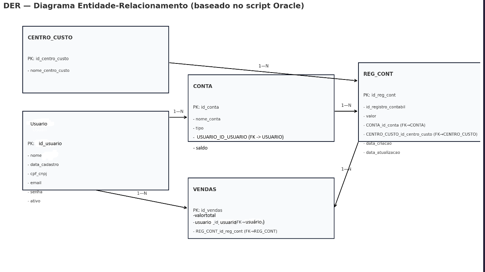
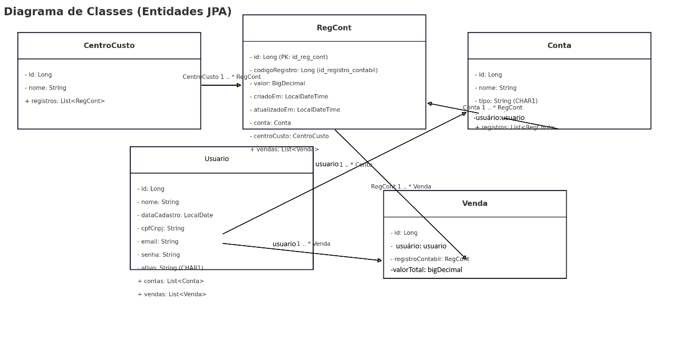

PITCH SPRINT 3:
https://youtu.be/4z9T6EHVzg8


PITCH SPRINT 2:
https://www.youtube.com/watch?v=kAkMJfVJ2lc

# Sistema de Gestão Financeira e Contábil

## Descrição

API RESTful desenvolvida em Spring Boot para gerenciamento de dados financeiros e contábeis, incluindo usuarios, centros de custo, contas, registros contábeis e vendas.


## Tecnologias Utilizadas

- **Java 17**
- **Spring Boot 3.5.6**
- **Spring Data JPA**
- **Hibernate**
- **Oracle Database** (produção) / **H2 Database** (desenvolvimento)
- **Lombok**
- **Bean Validation**
- **SpringDoc OpenAPI** (Swagger)
- **Maven**
- **RabbitMQ**
- **OpenFeign**
- **Flyway**
- **Spring security**

## Arquitetura

A aplicação segue os princípios de:
- **Programação Orientada a Objetos (POO)**
- **Coesão e Desacoplamento**
- **Padrões de Projeto** (Repository, Service Layer, DTO)
- **API RESTful** (Nível 3 - Richardson Maturity Model com HATEOAS)
- **Segurança** (Jwt,roles,algoritimo HMAC256)

### Arquitetura e Módulos

#### API Java (Este Projeto)
Esta API Spring Boot gerencia os domínios financeiros e contábeis:
- **Usuarios**: Gestão de usuarios
- **Centros de Custo**: Organização contábil
- **Contas Contábeis**: Contas de receita e despesa
- **Registros Contábeis**: Lançamentos financeiros
- **Vendas**: Registro de vendas

#### Módulo IoT (Oracle Apex)
As tabelas relacionadas a IoT (`dispositivo_iot`, `servico`, `venda_evento`) são gerenciadas por um módulo separado desenvolvido com **Oracle Apex**. Esta separação de responsabilidades garante:
- **Modularidade**: Cada sistema focado em seu domínio específico
- **Escalabilidade**: Evolução independente dos módulos
- **Manutenibilidade**: Código mais organizado e fácil de manter
- **Performance**: Otimização específica para cada contexto

Os dados são compartilhados através do mesmo banco de dados Oracle, permitindo integração entre os módulos quando necessário.

### Estrutura de Pacotes

```
com.fiap.financecontrol/
├── clients/          # Clients Feign para comunicação entre serviços (HTTP)
├── config/           # Configurações gerais (RabbitMQ, Feign, Security, Beans)
├── domains/          # Entidades JPA (modelo de domínio)
├── exceptions/       # Tratamento de exceções e handlers globais
├── presentation/     # Camada de entrada (Controllers REST)
│   └── dtos/         # DTOs de Request/Response
├── repositories/     # Interfaces de acesso a dados (Spring Data JPA)
├── security/         # Configurações de segurança (JWT, filtros, autenticação)
├── services/  

```

## Como Executar a Aplicação

### Pré-requisitos

- Java 17 ou superior
- Maven 3.6 ou superior
- Oracle Database (para ambiente de produção)

### Configuração do Banco de Dados

#### Ambiente Local (H2 - Desenvolvimento)
```bash
# A aplicação usa H2 em memória por padrão
# Acesse: http://localhost:8080/h2-console
# JDBC URL: jdbc:h2:mem:finance-control-db
# Username: sa
# Password: (vazio)
```

#### Ambiente de Desenvolvimento (Oracle)
```bash
# Configure as variáveis de ambiente (opcional):
export DB_USERNAME=appuser
export DB_PASSWORD=AppPass#2025

# Execute com profile dev:
mvn spring-boot:run -Dspring-boot.run.profiles=dev
```

**Configuração do Oracle:**
- **Host**: 140.238.179.84
- **Porta**: 1521
- **Service Name**: FREEPDB1
- **Usuário**: appuser
- **Senha**: AppPass#2025

**Antes de executar, certifique-se de:**
1. Executar o script `docs/database/challenge_oracle2_fixed.sql` no Oracle SQL Developer
2. O script criará as tabelas, sequences, constraints e dados padrão

### Executando a Aplicação

```bash
# Navegue até o diretório do projeto
cd Challenge_Java

# Execute a aplicação (ambiente local com H2)
mvn spring-boot:run

# Execute a aplicação (ambiente dev com Oracle FIAP)
mvn spring-boot:run -Dspring-boot.run.profiles=dev

# Ou compile e execute
mvn clean package
java -jar target/finance-control-0.0.1-SNAPSHOT.jar
```

A aplicação estará disponível em: `http://localhost:8080`

## Documentação da API

<<<<<<< HEAD
####  A aplicação utiliza Spring Security, portanto é necessário estar autenticado para 
#### acessar os endpoints protegidos.


     Realize o post para registrar usuarios com diferentes roles
    

      -POST
      http://localhost:8080/fiap/autenticar/registrar
    
    {
      "email": "useradmin@gmail.com",
      "senha": "1234",
      "cpfCnpj": "50789367667"
    }

    {
      "email": "usernormal@gmail.com",
      "senha": "1234",
      "cpfCnpj": "52789167667"
    }

    (ao registrar no banco de dados, favor alterar manualmente a role do userAdmin, para -> ADMIN)
#### Efetuar o login para geração do tokenJwt -> será usado a partir de agora em todas as requisições
    
    
    -POST
        http://localhost:8080/fiap/autenticar/login
    
      
      {
      "email":"useradmin@email.com",
      "password":"123456"
      }

    Response:
      {
      "token": "eyJ0eXAiOiJKV1QiLCJhbGciOiJIUzI1NiJ9..."
      }
      


### Swagger/OpenAPI

- **Swagger UI**: http://localhost:8080/swagger-ui.html
- **OpenAPI JSON**: http://localhost:8080/api-docs


### HATEOAS (Hypermedia as the Engine of Application State)

A API implementa **HATEOAS nível 3** do Richardson Maturity Model. Todas as respostas incluem links que permitem navegação dinâmica pelos recursos:

#### Exemplo de Resposta com Links
```json
{
  "id": 1,
  "nome": "João Silva",
  "email": "joao@email.com",
  "_links": {
    "self": {
      "href": "http://localhost:8080/fiap/usuarios/1"
    },
    "update": {
      "href": "http://localhost:8080/fiap/usuarios/1"
    },
    "delete": {
      "href": "http://localhost:8080/fiap/usuarios/1"
    },
    "contas": {
      "href": "http://localhost:8080/fiap/contas?usuarioId=1"
    },
    "vendas": {
      "href": "http://localhost:8080/fiap/vendas?usuarioId=1"
    }
  }
}
```

#### Navegação via Links
Os usuarios podem navegar pela API seguindo os links fornecidos nas respostas:
- **self**: Link para o próprio recurso
- **update**: Link para atualizar o recurso
- **delete**: Link para deletar o recurso
- **relacionados**: Links para recursos relacionados (ex: usuario → contas, vendas)

#### Paginação com Links
Nas respostas paginadas, são fornecidos links de navegação:
- **first**: Primeira página
- **prev**: Página anterior (se existir)
- **self**: Página atual
- **next**: Próxima página (se existir)
- **last**: Última página

### Endpoints Disponíveis

### Classe DataInitializer
    A classe DataInitializer é responsável por popular o 
    banco de dados automaticamente na inicialização da 
    aplicação, facilitando os teste de 
    endpoints da apliação.

    Ela utiliza CommandLineRunner para executar rotinas de 
    criação de dados iniciais, como:

    usuários (admin e comum)
    centro de custo
    contas contábeis


#### Usuarios
- `GET /fiap/usuarios` - Listar usuarios (com paginação, filtros e links HATEOAS )- ROLE -> ADMIN
- `GET /fiap/usuarios/{id}` - Buscar usuario por ID (com links HATEOAS)
- `POST /fiap/usuarios` - Criar novo usuario (retorna com links HATEOAS)
- `PUT /fiap/usuarios/{id}` - Atualizar usuario (retorna com links HATEOAS)
- `DELETE /fiap/usuarios/{id}` - Deletar usuario - ROLE -> ADMIN

#### Centros de Custo
- `GET /fiap/centros-custo` - Listar centros de custo (com paginação e links HATEOAS) 
- `GET /fiap/centros-custo/{id}` - Buscar centro de custo por ID (com links HATEOAS)
- `POST /fiap/centros-custo` - Criar novo centro de custo (retorna com links HATEOAS) - ROLE -> ADMIN
- `PUT /fiap/centros-custo/{id}` - Atualizar centro de custo (retorna com links HATEOAS) - ROLE -> ADMIN
- `DELETE /fiap/centros-custo/{id}` - Deletar centro de custo - ROLE -> ADMIN

#### Contas
- `GET /fiap/contas` - Listar contas (com filtros por tipo e links HATEOAS)
- `GET /fiap/contas/{id}` - Buscar conta por ID (com links HATEOAS)
- `POST /fiap/contas` - Criar nova conta (retorna com links HATEOAS) - ROLE -> ADMIN
- `PUT /fiap/contas/{id}` - Atualizar conta (retorna com links HATEOAS ) - ROLE -> ADMIN
- `DELETE /fiap/contas/{id}` - Deletar conta - ROLE -> ADMIN

#### Registros Contábeis
- `GET /fiap/registros-contabeis` - Listar registros contábeis (com filtros e links HATEOAS ) - ROLE -> ADMIN
- `GET /fiap/registros-contabeis/{id}` - Buscar registro por ID (com links HATEOAS )
- `POST /fiap/registros-contabeis` - Criar novo registro (retorna com links HATEOAS)
- `PUT /fiap/registros-contabeis/{id}` - Atualizar registro (retorna com links HATEOAS ) - ROLE -> ADMIN
- `DELETE /fiap/registros-contabeis/{id}` - Deletar registro - ROLE -> ADMIN
- `GET /fiap/registros-contabeis/"/saude-financeira` - Verificar saude financeira  

#### Vendas
- `GET /fiap/vendas` - Listar vendas (com filtros e links HATEOAS)
- `GET /fiap/vendas/{id}` - Buscar venda por ID (com links HATEOAS)
- `POST /fiap/vendas` - Criar nova venda (retorna com links HATEOAS)
- `PUT /fiap/vendas/{id}` - Atualizar venda (retorna com links HATEOAS)
- `DELETE /fiap/vendas/{id}` - Deletar venda

### Parâmetros de Paginação

Todos os endpoints de listagem suportam:
- `page` - Número da página (padrão: 0)
- `size` - Tamanho da página (padrão: 10)
- `direction` - Direção da ordenação: ASC ou DESC (padrão: ASC)

### Exemplos de Requisições


#### Criar usuario
```json
POST /fiap/usuarios
{
  "nome": "João Silva",
  "cpfCnpj": "12345678901",
  "email": "joao@email.com",
  "senha": "senha123",
  "ativo": "S"
}
```

#### Criar Conta
```json
POST /fiap/contas
{
  "nomeConta": "Receita de Vendas",
  "tipo": "R",
}
```

#### Criar Registro Contábil
```json
POST /fiap/registros-contabeis
{
  "valor": 1500.00,
  "contaId": 1,
  "centroCustoId": 1
}
```

## Diagramas

### Diagrama de Entidade-Relacionamento (DER)


**Nota**: O diagrama inclui as tabelas IoT (`dispositivo_iot`, `servico`, `venda_evento`) que são gerenciadas pelo módulo Oracle Apex separado.

### Diagrama de Classes das Entidades


### Arquitetura da Aplicação


## Testes da API

### Collection Postman/Insomnia
Acesse a pasta `docs/api-tests/` para encontrar:
- `postman-collection.json` - Collection completa do Postman com:
  - Todos os endpoints CRUD para todas as entidades
  - **Testes automatizados de HATEOAS** (validação de links)
  - Testes de paginação com links
  - Exemplos de navegação via links
  - Variáveis de ambiente para facilitar testes

**Como usar:**
1. Importe a collection no Postman/Insomnia
2. Configure a variável `baseUrl` se necessário (padrão: http://localhost:8080)
3. Execute os testes na ordem sugerida (Criar → Listar → Buscar → Atualizar → Deletar)
4. Os testes HATEOAS validam automaticamente a presença e estrutura dos links

### Executando Testes
```bash
# Executar todos os testes
mvn test

# Executar testes com relatório de cobertura
mvn test jacoco:report
```

### Testes Disponíveis
- `FinanceControlApplicationTests` - Teste de contexto Spring
- `UsuarioRepositoryTest` - Testes de repository
- `UsuarioControllerTest` - Testes de controller com MockMvc
- `CreateVendasServiceTest` - Teste do service com MockMvc
- `RelatorioContabilServiceTest` - Teste do service com MockMvc

## Configurações Adicionais

### Profiles Disponíveis
- `local` - H2 Database em memória (padrão)
- `dev` - Oracle Database para desenvolvimento

### Logs
A aplicação gera logs detalhados para:
- Operações de CRUD
- Erros e exceções

### Health Check
- **Health**: http://localhost:8080/actuator/health
- **Info**: http://localhost:8080/actuator/info
- **Metrics**: http://localhost:8080/actuator/metrics

## Estrutura do Banco de Dados

### Oracle Database
O banco de dados Oracle deve ser configurado com as seguintes tabelas:
- `Usuario` - Dados dos usuarios
- `CENTRO_CUSTO` - Centros de custo
- `CONTA_CONTABIL` - Contas contábeis (renomeada de CONTA na Sprint 2)
- `REG_CONT` - Registros contábeis
- `VENDAS` - Registro de vendas
- `DISPOSITIVO_IOT` - Dispositivos IoT (gerenciado pelo módulo Oracle Apex)
- `SERVICO` - Serviços disponíveis (gerenciado pelo módulo Oracle Apex)
- `VENDA_EVENTO` - Eventos de venda via IoT (gerenciado pelo módulo Oracle Apex)

**Scripts disponíveis:**
- `docs/database/challenge_oracle2_fixed.sql` - Script completo do banco de dados (inclui todas as tabelas)

### H2 (Desenvolvimento Local)
Para desenvolvimento local, a aplicação usa H2 em memória que cria automaticamente as tabelas.

## Testando a API

### 1. Verificar se a aplicação está rodando
```bash
# Health check
curl http://localhost:8080/actuator/health

# Swagger UI
# Acesse: http://localhost:8080/swagger-ui.html
```

### 2. Testar Endpoints

#### Criar usuario
```bash
curl -X POST http://localhost:8080/fiap/usuarios \
  -H "Content-Type: application/json" \
  -d '{
    "nome": "João Silva",
    "cpfCnpj": "12345678901",
    "email": "joao@email.com",
    "senha": "senha123",
    "ativo": "S"
  }'
```

#### Listar Usuarios
```bash
curl -X GET "http://localhost:8080/fiap/usuarios?page=0&size=10&direction=ASC"
```

#### Criar Centro de Custo
```bash
curl -X POST http://localhost:8080/fiap/centros-custo \
  -H "Content-Type: application/json" \
  -d '{
    "nomeCentroCusto": "Vendas Online"
  }'
```

### 3. Verificar Dados no Banco

#### Oracle FIAP
```sql
-- Verificar usuarios
SELECT * FROM USUARIO ORDER BY ID_USUARIO;

-- Verificar centros de custo
SELECT * FROM CENTRO_CUSTO ORDER BY id_centro_custo;


```


#### H2 Console
- URL: http://localhost:8080/h2-console
- JDBC URL: `jdbc:h2:mem:finance-control-db`
- Username: `sa`
- Password: (vazio)

#### RabbitMq

Para executar a mensageria do sistema, utilizamos o RabbitMQ via Docker.


```bash

  docker run -d -p 5672:5672 -p 15672:15672 rabbitmq:3-management
```
Por que usar esse comando?

- Esse comando sobe um container com o RabbitMQ já configurado, incluindo:

- Porta 5672 → comunicação da aplicação (Spring Boot)
Porta 15672 → painel de administração web
  Por que usar Docker?


    O uso do Docker foi adotado para:

    Evitar instalação manual do RabbitMQ e suas dependências (como Erlang)
    Garantir padronização do ambiente
    Facilitar a execução rápida do projeto
    Reduzir problemas de compatibilidade entre máquinas
    
    Com um único comando, o ambiente de mensageria fica pronto para uso.

Acesso ao painel

```http request
    http://localhost:15672
```
- Usuário: guest
  - Senha: guest

Uso no projeto

    A mensageria foi implementada para comunicação assíncrona:

    Ao criar uma venda, uma mensagem é enviada para a fila fila-vendas
    Um consumidor processa essa mensagem e registra o evento no sistema (log)

### Funcionalidades alem de crud...

- O serviço CreateVendasService implementa um fluxo completo de negócio para criação de vendas.
  Durante a execução, ele valida dados via Feign, atualiza saldo de conta, gera registro contábil,
  persiste a venda e publica um evento em RabbitMQ. Dessa forma, o sistema demonstra comunicação
  síncrona e assíncrona, indo além de operações CRUD e cobrindo parte relevante do processo de negócio.
```http request
    POST - http://localhost:8080/fiap/vendas
```

- O serviço RelatorioContabilService implementa um fluxo completo de análise contábil. A partir de um centro de custo e período (mês/ano), o sistema recupera os registros contábeis, classifica-os em entradas e saídas, calcula o saldo líquido e retorna um relatório consolidado.
  Esse processo envolve regras de negócio e agregação de dados, caracterizando um fluxo funcional.

```http request
    GET - http://localhost:8080/fiap/registros-contabeis/saude-financeira?centroCustoId=1001&mes=4&ano=2026
```


## Status do Projeto

### Sprint 1 ✅
- [x] Estrutura base do projeto Spring Boot
- [x] 5 entidades JPA com relacionamentos
- [x] Repositories com métodos customizados
- [x] DTOs de Request/Response com validações
- [x] Services para operações CRUD
- [x] Controllers REST com paginação
- [x] Tratamento global de exceções
- [x] Documentação completa
- [x] Testes unitários
- [x] Configuração para Oracle e H2
- [x] API RESTful Nível 1 (Richardson Maturity Model)

### Sprint 2 ✅
- [x] Atualização do banco de dados (CONTA → CONTA_CONTABIL)
- [x] Correção de mapeamentos JPA
- [x] **Implementação HATEOAS Nível 3**
- [x] Links de navegação em todas as respostas
- [x] Links de paginação
- [x] Links relacionados entre recursos
- [x] SpringDoc OpenAPI (temporariamente desabilitado - ver nota no README)
- [x] Collection Postman atualizada com testes HATEOAS
- [x] Documentação atualizada

### Sprint 3 ✅

- [x] Implementação do OpenFeign 
- [x] Implementação do rabbitmq (Mensageria)
- [x] Implementação do spring security
- [x] Dois tipos de usuarios no sistema - (Admin e User), com permissões diferentes.
- [x] Funcionalidades de fluxos completos alem de CRUD

## Funcionalidades Implementadas

### ✅ Entidades
- **Usuario**: Gestão de usuarios com validações de CPF/CNPJ e email únicos
- **CentroCusto**: Centros de custo para organização contábil
- **Conta**: Contas contábeis (Receita/Despesa) com relacionamento opcional com usuario
- **RegistroContabil**: Lançamentos contábeis com auditoria automática
- **Vendas**: Registro de vendas vinculadas a usuarios e registros contábeis

### ✅ API RESTful
- **Nível 3 Richardson Maturity Model** (HATEOAS implementado)
- **Paginação** em todos os endpoints de listagem
- **Links HATEOAS** em todas as respostas (self, update, delete, relacionados)
- **Navegação dinâmica** via links nas respostas
- **Filtros** por nome, tipo, data, valor
- **Validações** Bean Validation
- **Status HTTP** apropriados (200, 201, 204, 400, 404, 409, 500)

### ✅ Arquitetura
- **POO**: Encapsulamento, herança, polimorfismo
- **Coesão**: Cada classe com responsabilidade única
- **Desacoplamento**: Controllers → Services → Repositories, Feign Client, RabbitMq
- **Padrões**: Repository, Service Layer, DTO, Strategy
- **Persistência e Versionamento**: FlyWay


